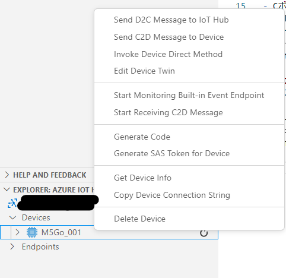

# M5IoTClient_withAzIoTHub
This is a sample code for connecting M5Stack Core to Azure IoT Hub via MQTT and performing bidirectional communication.  
This is an example of how to implement it without using Microsoft’s SDK.

# How to use
1. Place the files in the src folder in your project.
2. Reflect the contents of the platform.ini file in your project.
3. Set the parameters in the AzIoTConfig.h file.  
   Use the VSCode extension to get the device name and generate the SASToken.
4. Build and transfer the program to M5Stack.
5. Connect the ENV III sensor to M5Stack as the sample code uses it.

# About the sample code
- When the program starts, it connects to Azure IoT Hub via MQTT.
- Press the C button (the rightmost button) to send a message to IoT Hub.
- When a C2D message is sent from IoT Hub, it immediately notifies the receipt.
- When the direct method “GetTelemetry” is received, it returns the sensor data as a response.
- It updates the device twin properties every 5 minutes.

# Test with VSCode’s IoT Hub extension.
To send a C2D message, right-click on the device and send a C2D message.  
To execute a direct method, right-click on the device and execute Invoke Direct Method,   
and enter the method name and request payload.  
To confirm that the device twin properties have been updated, right-click on the device and execute Edit Device Twin.  

# CustomConnector_for_PowerApps
This is a custom connector configuration file for Power Apps and Power Automate of Microsoft Power Platform.
You can use the custom connector to execute methods such as GetDevices, SendC2D Message, Invoke DirectMethod via the REST API of IoT Hub.
To set up, you create a new custom connector and switch the edit mode to Swagger mode, and paste the contents of Swagger.yml.  
Create a new connection and set the API Key field to the generated SAS Token.

# ja-jp
# M5IoTClient_withAzIoTHub
M5Stack CoreからAzure IoT HubにMQTT接続して双方向通信を行うためのサンプルコードです。
MicrosoftのSDKは使用しないで実装する例です。

# 始め方
1. srcフォルダ内のファイルをあなたのプロジェクトに配置します。
2. platform.iniファイルの内容をあなたのプロジェクトに反映します。
3. AzIoTConfig.hファイルにパラメータを設定します。
  パラメータはVSCodeの拡張機能を使ってデバイス名の取得やSASTokenの生成を行ってください。
4. ビルドしてからプログラムをM5Stackに転送します。
5. サンプルコードでは、ENV IIIセンサーを使用しますのでM5Stackに接続をしてください。

# サンプルコードについて
- プログラムが起動すると、Azure IoT HubにMQTT接続します。
- Cボタン(右端のボタン)を押すとIoT Hubにメッセージを送信します。
- IoT HubからC2Dメッセージを送信すると、直ちに受信通知を行います。
- ダイレクトメソッドの「GetTelemetry」メソッドを受信すると、応答としてセンサーデータを返します。
- 5分ごとにデバイスツインプロパティを更新します。

# VSCodeのIoT Hub拡張機能を使ってテストしてください。
C2Dメッセージを送信するには、デバイスを右クリックしてC2Dメッセージを送信します。
ダイレクトメソッドを実行するには、デバイスを右クリックしてInvoke Direct Methodを実行して、メソッド名と要求ペイロードを入力してください。
デバイスツインプロパティが更新されたことを確認するは、デバイスを右クリックして、Edit Device Twinを実行します。

